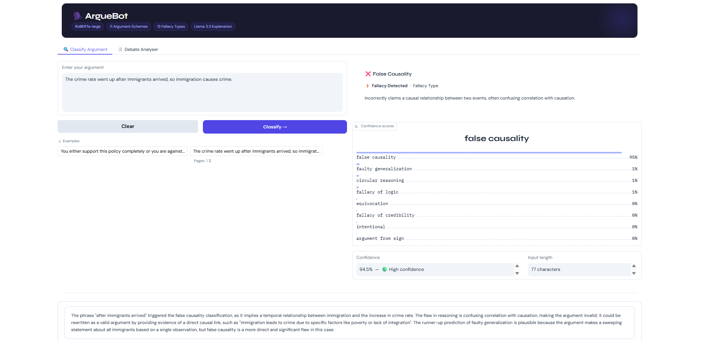

# 🗣️ ArgueBot — Argument Scheme & Fallacy Classifier

[](https://www.python.org/)
[](https://pytorch.org/)
[](https://huggingface.co/)
[](https://gradio.app/)
[](LICENSE)

> A fine-tuned **RoBERTa-large** model that classifies text into **24 categories** — 11 valid argument scheme types and 13 logical fallacy types — in a single inference pass, with a plain-English AI explanation powered by Llama 3.1 via Groq.

---

## 📌 Table of Contents

- [Overview](#overview)
- [Demo](#demo)
- [Project Structure](#project-structure)
- [Installation](#installation)
- [Usage](#usage)
- [Dataset](#dataset)
- [Model](#model)
- [Results](#results)
- [Contributing](#contributing)
- [Citation](#citation)

---

## Overview

ArgueBot is an end-to-end argument analysis tool built as a continuation of MSc thesis research in Computational Argumentation. Given any piece of text, the system:

1. Classifies it into one of **24 labels** — either a valid Walton argument scheme or a logical fallacy type
2. Generates a plain-English **AI explanation** pointing to the exact words or reasoning patterns that triggered the classification
3. In **Debate Analyser** mode, processes an entire paragraph sentence by sentence and produces a colour-coded results table

**Label space:**
- ✅ 11 argument scheme types (from Walton's taxonomy)
- ⚡ 13 logical fallacy types

---

## Demo




---

## Project Structure

```
arguebot/
│
├── roberta_classifier_training.py  
├── arguebot_gradio.py              
│             
│
├── data/
│   ├── ArgumentLabelDataset.csv         
│           
│
├── assets/
│   └── screenshot.png             
│
├── README.md

```

---

## Installation

### 1. Clone the repository

```bash
git clone git@github.com:isabelmaria123/ArgumentScheme-Fallacy-Classifier---ArgueBot.git
cd arguebot
```

### 2. Create a virtual environment (recommended)

```bash
python -m venv venv
source venv/bin/activate        # macOS / Linux
venv\Scripts\activate           # Windows
```

### 3. Install dependencies

```bash
pip install -r requirements.txt
```


---

## Usage

### Train the model

```bash

python roberta_classifier_training.py
```

The trained model is saved to `./roberta_unified_model/`.

### Launch the Gradio UI

```bash
python arguebot_gradio.py
```

Set your Groq API key inside `arguebot_gradio.py` before running:
```python
GROQ_API_KEY = "your_groq_api_key_here"
```

Get a free Groq key at [console.groq.com](https://console.groq.com).

A public URL will be printed:
```
Running on public URL: https://xxxxxxxx.gradio.live
```

### Quick test (no UI)

```python
import json, torch
from transformers import AutoTokenizer, AutoModelForSequenceClassification

MODEL_DIR = "./roberta_unified_model"
tokenizer = AutoTokenizer.from_pretrained(MODEL_DIR)
model     = AutoModelForSequenceClassification.from_pretrained(MODEL_DIR)
model.eval()

with open(f"{MODEL_DIR}/metadata.json") as f:
    meta = json.load(f)

label_map  = {int(k): v for k, v in meta["label_map"].items()}
scheme_ids = set(meta["scheme_ids"])

def predict(text):
    enc = tokenizer(text, return_tensors="pt", truncation=True, max_length=128)
    with torch.no_grad():
        logits = model(**enc).logits
    probs   = torch.softmax(logits, dim=1).squeeze().tolist()
    pred_id = int(torch.tensor(probs).argmax())
    return {
        "verdict":    "✅ Valid Argument" if pred_id in scheme_ids else "⚡ Fallacy",
        "label":      label_map[pred_id],
        "confidence": f"{probs[pred_id]:.1%}",
    }

print(predict("Introducing a four-day work week will boost employee wellbeing, reduce burnout, and ultimately increase overall productivity."))


print(predict("Don't trust him — he was caught lying before, so everything he says is wrong."))

```

---

## Dataset

The model was trained on a **combined dataset** of 24 classes:

| Source | Type | Classes | Samples |
|---|---|---|---|
| EthiX + Macagno | Argument schemes | 11 | 1829 |
| Custom fallacy dataset | Fallacy types | 13 | 4124 |

**Combined CSV format:**
| Column | Description |
|---|---|
| `Argument` | The argument text |
| `Label` | Scheme or fallacy label |

**Argument scheme labels:**
`argument from analogy` · `argument from alternatives` · `argument from cause to effect` · `argument from commitment` · `argument from example` · `argument from expert opinion` · `argument from negative consequences` · `argument from positive consequences` · `argument from practical reasoning` · `argument from sign` · `argument from values`

**Fallacy labels:**
`ad hominem` · `ad populum` · `appeal to emotion` · `circular reasoning` · `equivocation` · `fallacy of credibility` · `fallacy of extension` · `fallacy of logic` · `fallacy of relevance` · `false causality` · `false dilemma` · `faulty generalization` · `intentional`

---

## Model

| Property | Value |
|---|---|
| Base model | `roberta-large` |
| Task | 24-class text classification |
| Max token length | 128 |
| Optimiser | AdamW (lr=2e-5, weight_decay=0.01) |
| Loss | Weighted CrossEntropyLoss (handles class imbalance) |
| Early stopping | Patience=3, monitor=val_loss |
| Training split | 70 / 15 / 15 (train / val / test) |

**Training features:**
- Stratified train/val/test split
- Class weight balancing across 24 labels
- Gradient clipping (max_norm=1.0)
- Early stopping on validation loss


